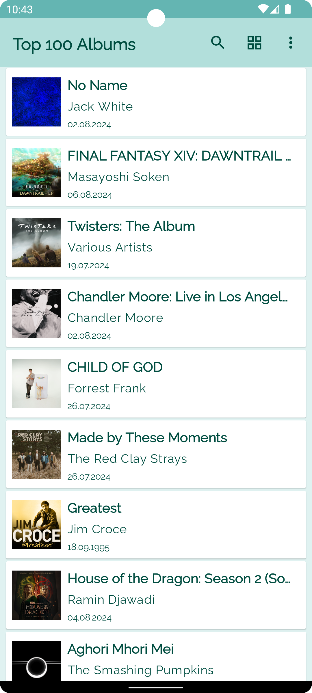
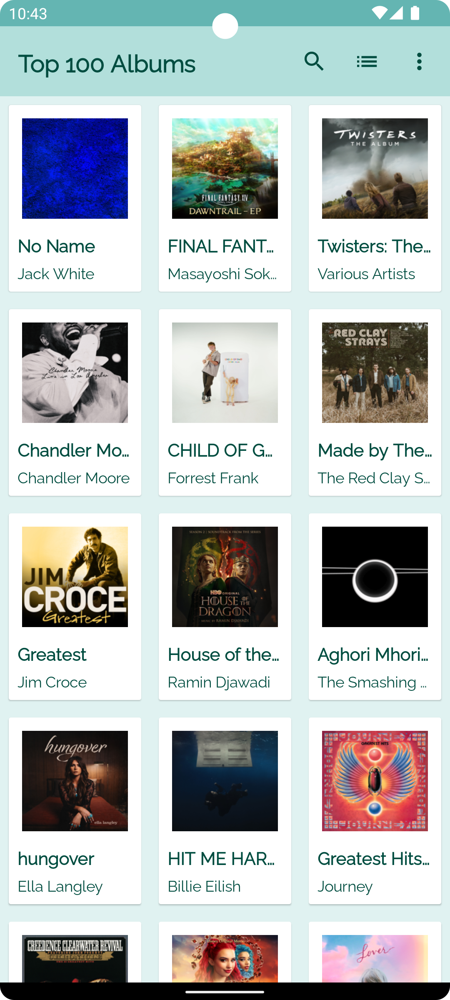

## Brief
This project is a proof of concept for an Android application that displays the top 100 albums from the iTunes API using Kotlin, Jetpack Compose, and Clean Architecture principles.

This Kotlin app needs to display the top 100 songs based on the iTunes API. The JSON feed is here: https://itunes.apple.com/us/rss/topalbums/limit=100/json

## Features
- **Retrieve Top 100 Albums**: Fetches the top 100 albums from the iTunes API
- **Display Albums**: Shows the albums in a list with thumbnails
- **View Modes**: Switch between GridView and ListView
- **Search Functionality**: Search albums by name
- **Album Details**: View album details on click

## Screenshots

 &emsp;&emsp;&emsp;&emsp; &emsp;&emsp;&emsp;&emsp; 

## Tech stack
- **Kotlin**: Programming language
- **Jetpack Compose**: UI toolkit for building native Android interfaces
- **Dagger Hilt**: Dependency injection
- **Material Design 3**: UI design guidelines
- **Retrofit**: HTTP client for API requests
- **Kotlin Coroutines**: Asynchronous programming
- **Paging Library**: Efficiently loads large data sets (branch: paging-library)
- **Target SDK**: 34

## Testing Strategy
Testing is done following the [testing pyramid](https://martinfowler.com/articles/practical-test-pyramid.html#TheTestPyramid) with a [given, when, then](https://martinfowler.com/bliki/GivenWhenThen.html) style.
- [Unit tests](app/src/test)
- [Integration tests](app/src/androidTest/java/com/example/knockoffspotify)
- [UI tests](app/src/androidTest/java/com/example/knockoffspotify/ui)
- [E2E tests](app/src/androidTest/java/com/example/knockoffspotify/FlowIntegrationTest.kt)

## Testing tech stack
- [JUnit4](https://junit.org/junit4/) testing framework
- [Mockk](https://mockk.io/) for Mocking
- [Coroutine Testing API](https://kotlinlang.org/api/kotlinx.coroutines/kotlinx-coroutines-test/) for testing coroutines
- [Kotlin Turbine](https://github.com/cashapp/turbine) for testing Flows

## Future features
- A Favorite option for albums
- Sort list items by name, artist, or release date
- Menu option to access other API endpoints
- Offline mode
- Filter by genre or artist
- Artist profile