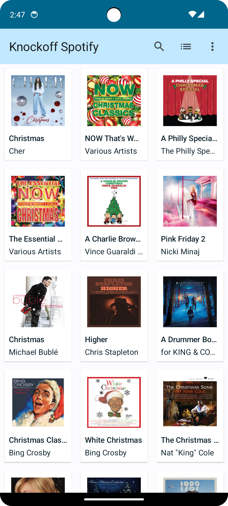
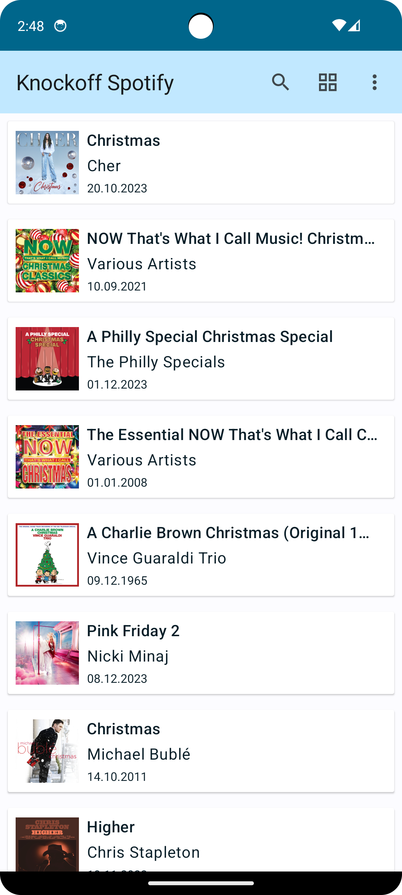

## Brief
This Kotlin app needs to display the top 100 songs based on the iTunes API. The JSON feed is here: https://itunes.apple.com/us/rss/topalbums/limit=100/json

## Features
- Can retrieve top 100 list
- Display as list with thumbnail from API
- Can switch between GridView & ListView

## Screenshots

 &emsp;&emsp;&emsp;&emsp; &emsp;&emsp;&emsp;&emsp; 

## Tech stack
- Jetpack Compose
- Dagger Hilt
- Material Design 3
- Retrofit
- Kotlin Coroutines
- Paging Library
- Target SDK: 32

## Testing Strategy
Testing is done following the [testing pyramid](https://martinfowler.com/articles/practical-test-pyramid.html#TheTestPyramid) with a [given, when, then](https://martinfowler.com/bliki/GivenWhenThen.html) style.
- [Unit tests](app/src/test)
- [Integration tests](app/src/androidTest/java/com/example/knockoffspotify)
- [UI tests](app/src/androidTest/java/com/example/knockoffspotify/ui)
- [E2E tests](app/src/androidTest/java/com/example/knockoffspotify/FlowTest.kt)

## Testing tech stack
- [JUnit4](https://junit.org/junit4/) testing framework
- [Mockk](https://mockk.io/) for Mocking
- [Coroutine Testing API](https://kotlinlang.org/api/kotlinx.coroutines/kotlinx-coroutines-test/) for coroutines
- [Kotlin Turbine](https://github.com/cashapp/turbine) for Flows

## Future features
- View more details when clicked
- Allow list to be searchable
- A Favorite option
- Can sort list items
- Menu option to access other API endpoints